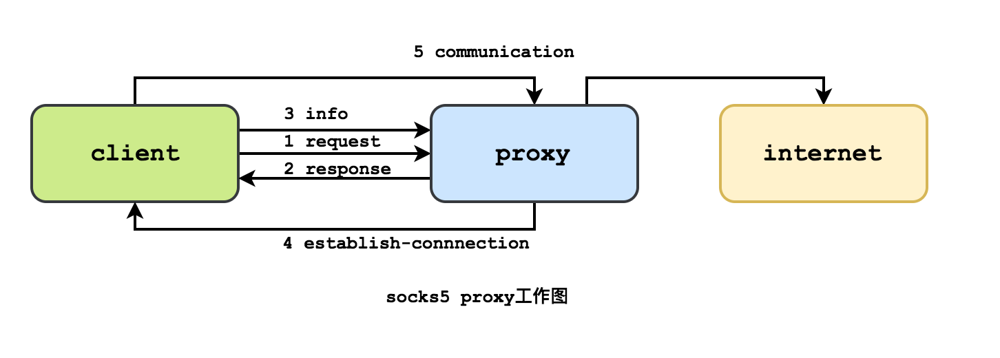
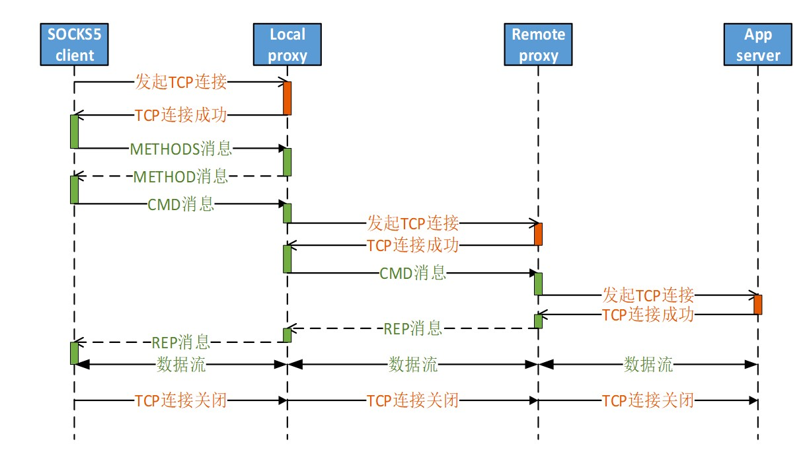

# To record the 8 homework and the final project of course

> # ***2020/10/20 First HW***: Using asyncio  high level APIs to implements a  socks5 proxy server

## Stream APIs

- coroutine
  - asyncio.open_connection(host=None,*,loop=None,limit=None,ssl=None,family=0,proto=0,flags=0,sock=None,local_addr=None,server_hostname=None,ssl_handshake_timeout=None)
    - 创建一个网络连接，并返回一对（reader,writer）对象
    - reader和writer对象是StreamReader和StreamWriter类的实例
    - loop是可选参数
    - limit限定返回的StreamReader实例使用的缓冲区大小, default_size = 64KB
  - asyncio.start_server(client_connected_cb,host=None,port=None,*,loop=None,limit=None,family=socket.AF_UNSPEC,flags=socket.AI_PASSIVE,sock=None,backlog=100,ssl=None,reuse_address=None,reuse_port=None,ssl_handshake_timeout=None,start_serving=True)
    - 启动一个socket服务端。 
    - client_connected_cb指定的回调函数，在新连接建立的时候被调用。该回调函数接收StreamReader和StreamWriter类的‘实例对’(reader,writer)作为两个参数。
    - client_connected_cb可以是普通的可调用函数，也可以是协程函数。如果是协程函数，那么会被自动封装为Task对象处理
- StreamReader
  -  read(n=-1)
    -  最多读取n字节数据。如果n未设置，或被设置为-1，则读取至EOF标志，并返回读到的所有字节。
- StreamWriter
  - write(data)
    - 向数据流中写入数据。
    - write()应同drain()一同使用。
  - drain()
    - 这是一个与底层IO输入缓冲区交互的流量控制方法。当缓冲区达到上限时，drain()阻塞，待到缓冲区回落到下限时，写操作可以被恢复。当不需要等待时，drain()会立即返回。
  
## socks协议
[RFC1928]

- *socks协议的设计初衷是在保证网络隔离的情况下，提高部分人员的网络访问权限，但是国内似乎很少有组织机构这样使用。一般情况下，大家都会使用更新的网络安全技术来达到相同的目的。*
- *但是由于socksCap32和PSD这类软件，人们找到了socks协议新的用途：突破网络通信限制，这和该协议的设计初衷正好相反。另外，socks协议也可以用来内网穿透。*
- *socks支持多种用户身份验证方式和通信加密方式*
- *socks工作在比HTTP代理更低的层次：socks使用握手协议来通知代理软件其客户端试图进行的连接socks，然后尽可能透明地进行操作，而常规代理可能会解释和重写报头（例如，使用另一种底层协议，例如FTP；然而，HTTP代理只是将HTTP请求转发到所需的HTTP服务器）。虽然HTTP代理有不同的使用模式，CONNECT方法允许转发TCP连接；然而，socks代理还可以转发UDP流量和反向代理，而HTTP代理不能。HTTP代理通常更适合HTTP协议，执行更高层次的过滤（虽然通常只用于GET和POST方法，而不用于CONNECT方法）。socks不管应用层是什么协议，只要是传输层是TCP/UDP协议就可以代理。*
- 


## 运行截图


> # ***2020/10/28 Second HW***: Using httplib/aiohttp to implements a http tunnel to get through the firewall

A kind of method to replace the HTTP proxy

[RFC2817]

Requesting a Tunnel with CONNECT

   A CONNECT method requests that a proxy establish a tunnel connection
   on its behalf. The Request-URI portion of the Request-Line is always
   an 'authority' as defined by URI Generic Syntax [2], which is to say
   the host name and port number destination of the requested connection
   separated by a colon:

      CONNECT server.example.com:80 HTTP/1.1
      Host: server.example.com:80
      
   Other HTTP mechanisms can be used normally with the CONNECT method --
   except end-to-end protocol Upgrade requests, of course, since the
   tunnel must be established first.

   For example, proxy authentication might be used to establish the
   authority to create a tunnel:
   
      CONNECT server.example.com:80 HTTP/1.1
      Host: server.example.com:80
      Proxy-Authorization: basic aGVsbG86d29ybGQ=

   Like any other pipelined HTTP/1.1 request, data to be tunneled may be
   sent immediately after the blank line. The usual caveats also apply:
   data may be discarded if the eventual response is negative, and the
   connection may be reset with no response if more than one TCP segment
   is outstanding.
   
Establishing a Tunnel with CONNECT
   Any successful (2xx) response to a CONNECT request indicates that the
   proxy has established a connection to the requested host and port,
   and has switched to tunneling the current connection to that server
   connection.


The relationship with the SOCKS5

Similarity:
    
        - should memtion the targeted host and port
        - should set up the tunnel that counld transfer any kind of data, which is transparent to tunnel
        - the data after the head along belongs to the content
        - client authentication should be provided
        
Differences:
        
        - client and http tunnel can be runned in the same TLS layer
        - client and remote server are in the same TLS layer
        - use TLS to protect the username and password in the proxy request
        - tunnel does not identify domain name and IP address in the Connection request
        - HTTP/1.1 can transfer any kind of data structures.

> # ***2020/11/8 Third HW***: Using local/remote proxy to get through the firewall to get the webpage

Based on the hw1 and hw2

Structure is as follow:


Test Results:
  
  
  
> # ***2020/11/12 Fourth HW***: Using aiosqlite\sqlite to realize authentication from local_proxy to remote_proxy
create database in remote_server
```sql
    create database user;
    drop table user;
    create table user(
        name text primary key,
        password text not null
    );
    insert into user(name,password) values('u1', '11');
    insert into user(name,password) values('u2', '22');
    insert into user(name,password) values('u3', '33');
```
to avoid being sql injection
instead of using 
```sql
    async with aiosqlite.connect('cache.db') as db:
        async with db.execute("SELECT * FROM USER WHERE USERNAME='{0}'".format(username)) as cur:
```
I use ? placeholder so that the sql engine could recognize the variant correctly and avoid the injection
```python
    if submit.decode().split(" ")[0] == "sumbit:":
        params = submit.decode().split(" ")
        username, password = params[1], params[2]
        async with aiosqlite.connect('cache.db') as db:
            async with db.execute('SELECT * FROM USER WHERE USERNAME=? and PASSWORD=?', (username, password, ) ) as cur:
```
**multi user login and request for webpage**


> # ***2020/11/18 Fifth HW***: Using Token bucket to control the throughput 
# overload protection
## 漏桶算法和令牌桶算法
## 原理： 给每个用户分配一个桶，每秒接受来自用户的请求，超出桶容量的部分直接丢弃，没有超过的部分放到桶里面，每秒处理k

##令牌桶算法

##每秒会有 r 个令牌放入桶中，或者说，每过 1/r 秒桶中增加一个令牌
##桶中最多存放 b 个令牌，如果桶满了，新放入的令牌会被丢弃
##当一个 n 字节的数据包到达时，消耗 n 个令牌，然后发送该数据包
#3如果桶中可用令牌小于 n，则该数据包将被缓存或丢弃

##漏桶算法

##数据被填充到桶中,并以固定速率注入网络中,而不管数据流的突发性
##如果桶是空的,不做任何事情
##主机在每一个时间片向网络注入一个数据包,因此产生一致的数据流


## 读的时候不需要流量控制，无论是从local_proxy读到还是从server读到，都直接存到桶里面
## 有两个写进程需要一直运行，一个是从用户端发送到远程服务器，另一个是从远程服务器发送到客户端，都是while循环，当桶里面数据不为空，就发送数据